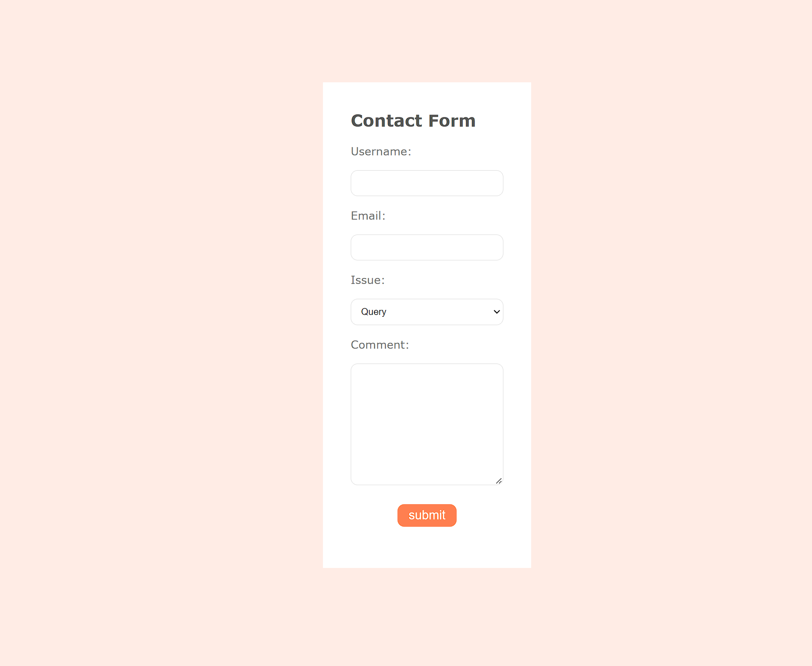

# Simple Web Contact Form

This is my solution to the [Simple Web Contact Form](https://www.codementor.io/projects/web/create-a-contact-form-b2n9ltrdy1) project from DevProjects.

## Table of Contents

- [Overview](#overview)
- [Requirements](#requirements)
- [Extra Challenge](#extra-challenge)
- [Tech](#tech)
- [Screenshot](#screenshot)
- [Links](#links)
- [Author](#author)

### Overview

A form often needs to be used to pass data to various other applications. In many cases, it could be a database, in others, it may be to give a specific answer or a quote. Regardless of how the information may need to be used, it is an important skill to be able to move data to new pages so it can be manipulated for use in further code. For this project, you will create a HTML web form.

### Requirements

- Text input for user’s name
- Text input for user’s email address
- Drop down to select user’s issue (Query, Feedback, Complaint, Other)
- Text area for user’s comment
- The form will post to a second page which will display the information in an easy to read format.

### Extra challenge

- Add an edit button to the second page, send the data back to the form, and autofill the data back into the fields.
- Add a submit button on the second page which will save the response to a database table.

### Tech

- HTML
- PHP
- PDO
- MySQL
- Heroku
- CSS

### Screenshot

### Links

- [Solution](https://www.codementor.io/project-solutions/e9zt6mreoc)
- [Live Site](https://hidden-cliffs-05435.herokuapp.com/)

### Author

- Website - [Carlos Ramirez](https://cjramirez.tech/)
- Frontend Mentor - [@cjislegit](https://www.frontendmentor.io/profile/cjislegit)
- Twitter - [@cjram11](https://twitter.com/cjram11)
